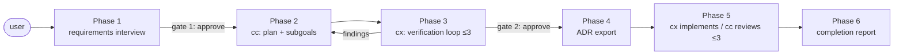

# duet

**English** | [日本語](./README.ja.md)

A plugin that turns Claude Code (cc) and Codex (cx) into a fixed-role development duo: one plans and reviews, the other verifies and implements. Works in both Claude Code and Codex CLI from a single codebase.

## Structure map

The full structure map (component inventory, execution flow, and a representative trace) is maintained as an Excalidraw diagram. Open [`docs/out/duet-en.excalidraw`](./docs/out/duet-en.excalidraw) at [excalidraw.com](https://excalidraw.com). The canonical, reviewable record behind it is [`docs/structures/structure-duet-en.yaml`](./docs/structures/structure-duet-en.yaml) — structural changes show up as diffs of this YAML.



## Why fixed roles?

- cc (Claude Code) does planning, subgoal decomposition, and review of the implemented code.
- cx (Codex) does plan verification (hole-finding) and implementation.
- The launching CLI does orchestration and the requirements interview.

cx invents its own goals when the objective is ambiguous. So the pipeline starts by pinning requirements down in an interview and handing them over as a document. And because the verifier is a different model than the planner, the verification loop is a genuine cross-examination rather than self-grading.

## Pipeline

1. Requirements interview → `requirements.md` → user approval
2. cc plans and decomposes into subgoals → `plan.md`
3. cx verifies the plan (each subgoal + overall consistency). Converges on zero high findings or after 3 loops → user approval
4. The converged plan is exported as `adr-*.md`
5. cx implements subgoal by subgoal; cc reviews. Failures are fixed in the same session (max 3 rounds)
6. Completion report

All state lives in `.duet/` inside the target repository, so an interrupted run resumes where it left off.

## Prerequisites

- Both the `claude` and `codex` CLIs installed.
- A default model configured in each CLI's config. The plugin never specifies a model. A strong model is recommended for verification and implementation.
- Tested against codex-cli 0.151.x.
- Pipeline behavior was verified with Claude (Fable 5) and GPT (Sol) as the config defaults. Other models (e.g. Astra or Fable 5.1) may behave differently.

## Installation

Claude Code:

```
/plugin marketplace add <path to this repository>
/plugin install duet@duet
```

Codex CLI:

```
codex plugin marketplace add <path to this repository>
codex plugin add duet@duet
```

## Usage

Run in the target repository:

```
/duet I want to add a login feature
```

Running with no arguments resumes from `.duet/state.json`. In Codex, invoke the duet skill directly.

## Tips: pair it with a grilling skill

duet pairs well with a skill that grills you about your idea (e.g. the `grilling` skill from mattpocock-skills). Run it around Phase 1: the answers you give under tough questioning become the subsections of the requirements and the plan. Phase 3 then runs cx's verification loop over each of those subsections. Your idea gets stress-tested twice — once by human dialogue, once by cross-model verification — so gaps rarely survive and the documents come out well organized.

## herdr integration (optional)

Launch duet inside a [herdr](https://herdr.dev) pane and you get desktop notifications at every point that waits on a human (approval gates, escalations, completion). It auto-detects `HERDR_ENV=1`, so no setup is needed. Outside herdr there are no notifications and no behavioral change.

Hands-off example: create a private room (worktree) in herdr, launch `/duet` inside it, and go back to other work. When an approval is needed the notification lights up, and you step in to move things forward.

## Safety notes

- The plugin performs no git operations (add / commit / branch / worktree). Committing is the user's job.
- cx implements inside a workspace-write sandbox; writes are confined to the target repository. Network access is allowed for adding dependencies.

## Disclaimer

- This plugin is provided "AS IS", without warranty of any kind.
- duet orchestrates external CLIs that autonomously produce plans, verdicts, and code.
  Any of these outputs can be wrong. The approval gates and review loops reduce the risk
  but guarantee nothing. Review every artifact — especially generated code and test
  results — before committing. Final responsibility for what you ship stays with you.
- Implementation runs with network access enabled, so cx may add dependency packages.
  Review any added dependencies before adopting them (supply-chain risk).
- Running the pipeline consumes the quota and incurs the costs of your own
  Claude Code and Codex subscriptions or API plans. All usage costs are yours.
- This is an unofficial, third-party plugin. It is not affiliated with, or endorsed by,
  Anthropic or OpenAI. Claude Code and Codex belong to their respective owners.
- Behavior depends on the installed CLI versions and on the models each CLI's config
  selects (verified against codex-cli 0.151.x, with Claude Fable 5 and GPT Sol).
  Future CLI versions or newer models may change behavior and break the pipeline.
- The authors accept no liability for damages arising from use of this plugin.
  See [LICENSE](./LICENSE) for details.

## License

MIT. See [LICENSE](./LICENSE).
